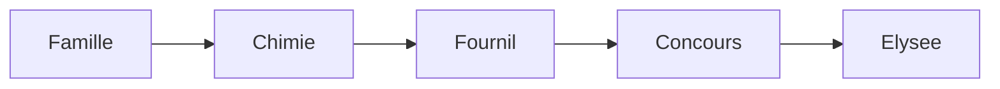
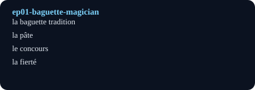

# Le magicien des baguettes (The Baguette Magician)

## Pourquoi ce nœud — explication
A baker's son resists, then embraces, the family bakery: chemistry studies become bread science, and obsession with the best-baguette contest ends at the Elysee. Core lesson: craftsmanship as applied chemistry plus perseverance.
Focus: Food craft / family pressure / chemistry of bread · Level A2–B1 · [[index-francais]]

## English synopsis (résumé en anglais)
A baker's son resists, then embraces, the family bakery: chemistry studies become bread science, and obsession with the best-baguette contest ends at the Elysee. Core lesson: craftsmanship as applied chemistry plus perseverance.

## Idées clés
1. Family trade vs 'real' studies: the mother pushes engineer/lawyer, the father quietly hopes for succession.
2. Chemistry as baking theory: fermentation, temperature, humidity, and dough as a living system.
3. Competition as deliberate practice: one year of testing variables to win the best traditional baguette.

## Point de grammaire
Passé composé vs imparfait for narrating background vs events (`je faisais` vs `j'ai gagné`). — see also the linked grammar hub.

En bref: $$R = \frac{\text{croustillant dehors}}{\text{moelleux dedans}}$$

## Extrait (transcript, 6 lignes)
| French | English | Notes |
|---|---|---|
| Tous les jours, je conduis mon camion et j'apporte les baguettes dans un panier. Je vais directement dans la cuisine. Je laisse le panier là avec les 20 baguettes. Ensuite, je prends le panier vide et je pars. |  |  |
| Tous les boulangers veulent gagner le concours de la meilleure baguette de Paris. Si un boulanger vous dit le contraire, c'est un menteur, et il ne faut pas le croire ! |  |  |
| Il a fait la connaissance de ma mère, et ensemble, ils sont venus à Paris. Ils ont ouvert leur première boulangerie. |  |  |
| Grandir dans une boulangerie, c'est une expérience unique. J'y étais tout le temps et je devais rester sur un tapis où ma mère pouvait me voir, c'était mon territoire. Elle devait pouvoir s'occuper de moi et servir les clients en même temps. |  |  |
| Mes parents nous ont appris à travailler en famille, à être très solidaires. Alors, je servais avec ma mère, je faisais la vaisselle avec les employés et je cuisinais avec mon père. |  |  |
| Je détestais les vacances scolaires parce que tous mes amis étaient en vacances, et moi, je devais travailler dans la boulangerie. Mais… il y avait des avantages. Les jours où j'allais à l'école, je pouvais prendre des croissants et les donner à mes amis. J'étais content de pouvoir les partager avec eux ! |  |  |

## Vocabulaire clé
- **la baguette tradition** — traditional baguette (contest criterion: taste + aroma)
- **la pâte** — dough (living, changes daily)
- **le concours** — competition (prestigious bakery prize)
- **la fierté** — pride (delivering bread to the president)

## Flashcards (source — synced to Flashcards tab by course `French`)
| Front | Back | Hint |
|---|---|---|
| la baguette tradition | traditional baguette | contest criterion: taste + aroma |
| la pâte | dough | living, changes daily |
| le concours | competition | prestigious bakery prize |
| la fierté | pride | delivering bread to the president |

## Liens
- [[ep09-soccer-power]]
- [[ep67-french-gastronomy]]
- [[grammaire-passe-compose-imparfait]]

#french #podcast #food #family #craft #lecture

## Practice — open in app
- [[quiz:2|Starter quiz: French podcast]]
- [[card:2|la baguette tradition]] · [[card:3|gagner / perdre]] · [[card:4|avoir le trac]]
- [[pdf:French-Reader-A2.pdf|French Reader booklet]] · [[pdf:French-Reader-A2.pdf#page=2|Reader p.2: boulangerie]]
