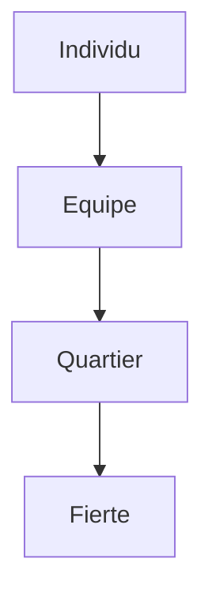

# Le pouvoir du foot (Soccer Power)

## Pourquoi ce nœud — explication
How soccer confers belonging: a personal story about playing, losing, and finding a team identity. Core lesson: sport vocabulary plus the social function of clubs.
Focus: Sport / identity / community · Level A2–B1 · [[index-francais]]

## English synopsis (résumé en anglais)
How soccer confers belonging: a personal story about playing, losing, and finding a team identity. Core lesson: sport vocabulary plus the social function of clubs.

## Idées clés
1. Sport as integration: the pitch as a place where origin stops mattering.
2. Competition mindset: hating to lose as fuel for training.
3. Collective rituals: supporters, chants, neighborhood pride.

## Point de grammaire
Expressing cause and consequence (`grâce à`, `à cause de`, `donc`). — see also the linked grammar hub.

En bref: $$P(\text{victoire}) = f(\text{entraînement}, \text{cohésion})$$

## Extrait (transcript, 6 lignes)
| French | English | Notes |
|---|---|---|
| J'ai regardé le match à la maison avec ma famille. J'étais dans le salon avec mes parents, des amis de mes parents, des voisins. Normalement, ils ne sont pas très fans de foot. Mais là, tout le monde adorait ça ! |  |  |
| Je me souviens du premier but de Zidane. Il a marqué avec la tête. C'était incroyable ! Juste avant la mi-temps, il a marqué un deuxième but. À chaque but, je courais et je sautais partout dans le salon. Après la victoire, les joueurs sont devenus des héros. Tout le pays était avec eux. |  |  |
| Pour les filles, ce n'était pas très facile de jouer au foot. Il n'y avait pas beaucoup d'équipes, et pas beaucoup d'endroits où on pouvait jouer. À treize ans, j'ai dû choisir : jouer avec des garçons plus jeunes, ou avec des femmes adultes. J'ai vite compris que dans le foot, il n'y avait pas de place pour quelqu'un comme moi. Mais je voulais que ça change. |  |  |
| À l'école, je n'avais pas beaucoup d'amis. J'étais différente des autres. Et au foot, il n'y avait pas d'équipe pour les filles de mon âge, donc je jouais avec des femmes beaucoup plus âgées. L'entraîneur ne me laissait pas beaucoup jouer. Je restais souvent assise sur le banc de touche. |  |  |
| Après l'entraînement, certaines des meilleures joueuses ne me parlaient même pas. Elles m'ignoraient complètement. Je sentais que je n'avais pas vraiment ma place. |  |  |
| Je cherchais une équipe. Je voulais jouer pour le plaisir, sans compétition. Je voulais une équipe inclusive, pour jouer, mais aussi pour être moi-même. Alors, j'ai entendu parler des Dégommeuses. |  |  |

## Vocabulaire clé
- **le match** — match (le foot = soccer)
- **l'équipe** — team (feminine noun)
- **gagner / perdre** — to win / to lose (core verbs)
- **le supporter** — fan (also: supporter)

## Flashcards (source — synced to Flashcards tab by course `French`)
| Front | Back | Hint |
|---|---|---|
| le match | match | le foot = soccer |
| l'équipe | team | feminine noun |
| gagner / perdre | to win / to lose | core verbs |
| le supporter | fan | also: supporter |

## Liens
- [[ep01-baguette-magician]]
- [[ep43-black-paris]]
- [[vocabulaire-sport]]

#french #podcast #sport #identity #lecture

## Practice — open in app
- [[quiz:2|Starter quiz: French podcast]]
- [[card:2|la baguette tradition]] · [[card:3|gagner / perdre]] · [[card:4|avoir le trac]]
- [[pdf:French-Reader-A2.pdf|French Reader booklet]] · [[pdf:French-Reader-A2.pdf#page=2|Reader p.2: boulangerie]]
