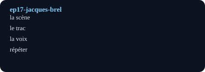

# En scène avec Jacques Brel (In the Spotlight with Jacques Brel)

## Pourquoi ce nœud — explication
A performer confronts stage fright through Jacques Brel: breath, diction, and emotional honesty. Core lesson: music vocabulary plus performing-arts expressions.
Focus: Music / stage fright / chanson · Level A2–B1 · [[index-francais]]

## English synopsis (résumé en anglais)
A performer confronts stage fright through Jacques Brel: breath, diction, and emotional honesty. Core lesson: music vocabulary plus performing-arts expressions.

## Idées clés
1. Brel as a model: total commitment on stage, no halfway.
2. Tract (stage fright): breathing drills and preparation rituals.
3. Chanson as storytelling: every song is a small theatre piece.

## Point de grammaire
The subjunctive after emotion (`avoir peur que + subjonctif`). — see also the linked grammar hub.

En bref: $$\text{émotion} = \text{texte} \times \text{interprétation}$$

## Extrait (transcript, 6 lignes)
| French | English | Notes |
|---|---|---|
| C'est un métier difficile. On se fatigue vite. C'est aussi un métier solitaire. Souvent, on est loin de sa famille. Je voulais arrêter de faire ce métier. Mais je ne savais pas quoi faire d'autre. |  |  |
| Je ne sais pas pourquoi j'ai choisi ce CD. Depuis que j'ai 15 ans, tout le monde dit que je ressemble à Jacques Brel : mes professeurs, mes collègues… C'est peut-être pour ça que j'ai choisi ce CD. |  |  |
| Je me suis dit : « Wow, c'est une chanson vraiment incroyable ! » Même la musique était magnifique. Mais quand j'ai commencé à chanter, ma voix s'est connectée à celle de Brel. Il y avait  sa  voix, et il y avait  ma  voix. Mais c'était  une seule  voix. Brel et moi. |  |  |
| Moi, devenir chanteur ? Je n'y avais jamais pensé. Mais à ce moment-là, c'était très clair. C'était une évidence. Je prends souvent mes décisions comme ça. En général, les gens hésitent quand ils prennent des décisions. Ils hésitent beaucoup pour les choses importantes. Mais moi, je me décide vite, en un instant. J'avais décidé : je voulais essayer de devenir comme Jacques Brel. |  |  |
| J'avais un objectif : je voulais chanter à l'Olympia. Jacques Brel a fait ses plus grands concerts dans cette salle. Chanter là-bas, c'était le but de ma carrière. |  |  |
| Ma compagne connaît ma personnalité. Elle s'est probablement dit : « Ça va passer. Je ne vais rien dire. » Elle n'a pas pris cela au sérieux. Elle pensait que j'abandonnerais cette idée rapidement. Pour elle, c'était juste une phase. |  |  |

## Vocabulaire clé
- **la scène** — stage (en scène = on stage)
- **le trac** — stage fright (avoir le trac)
- **la voix** — voice (la voix de la France echo)
- **répéter** — to rehearse (répétition)

## Flashcards (source — synced to Flashcards tab by course `French`)
| Front | Back | Hint |
|---|---|---|
| la scène | stage | en scène = on stage |
| le trac | stage fright | avoir le trac |
| la voix | voice | la voix de la France echo |
| répéter | to rehearse | répétition |

## Liens
- [[ep22-chanson-revolutionnaire]]
- [[ep35-voix-de-la-france]]
- [[vocabulaire-musique]]

#french #podcast #music #stage #lecture

## Practice — open in app
- [[quiz:2|Starter quiz: French podcast]]
- [[card:2|la baguette tradition]] · [[card:3|gagner / perdre]] · [[card:4|avoir le trac]]
- [[pdf:French-Reader-A2.pdf|French Reader booklet]] · [[pdf:French-Reader-A2.pdf#page=2|Reader p.2: boulangerie]]
