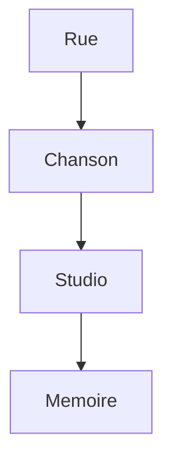
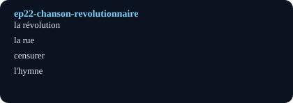

# Une chanson révolutionnaire (A Song of Revolution)

## Pourquoi ce nœud — explication
A revolutionary song is traced from street to studio: who wrote it, what it risked, and why people still sing it. Core lesson: history vocabulary plus the curated translation method (French line, English line, note).
Focus: History / protest song / record digging · Level A2–B1 · [[index-francais]]

## English synopsis (résumé en anglais)
A revolutionary song is traced from street to studio: who wrote it, what it risked, and why people still sing it. Core lesson: history vocabulary plus the curated translation method (French line, English line, note).

## Idées clés
1. Songs as archives: lyrics preserve what textbooks flatten.
2. Censorship and courage: singing could cost a career.
3. The curated-translation table as a study tool: French / English / Notes.

## Point de grammaire
Relative pronouns (`qui`, `que`, `dont`) to link a song to its history. — see also the linked grammar hub.

En bref: $$\text{mémoire} = \sum \text{couplets}$$

## Extrait (transcript, 6 lignes)
| French | English | Notes |
|---|---|---|
| Mon ami s'appelle Amine Al-Ghozzi, et c'est un poète extraordinaire. Il m'a donné un bout de papier, et il m'a dit : « J'ai quelque chose pour toi. C'est un poème que j'ai écrit. J'aimerais que tu le chantes. » |  |  |
| J'ai grandi en Tunisie. Dans mon pays, en 2007, c'était la dictature. Ben Ali était devenu président après un coup d'État. Il était au pouvoir depuis 20 ans. Il y avait beaucoup de corruption, de répression et de pauvreté. |  |  |
| Le gouvernement pouvait mettre en prison tous les gens qui le critiquaient. Mais moi, je crois en la vérité. C'est important de pouvoir dire ce qui ne va pas, et de parler d'un monde meilleur. |  |  |
| Je trouvais le résultat formidable. Mais je ne savais pas que cette chanson allait marquer mon pays, la Tunisie, à un moment important de son histoire. C'était incroyable, mais notre chanson allait devenir l'hymne de la Révolution arabe. |  |  |
| J'aime beaucoup la musique tunisienne des années 1900 à 1950. Les artistes étaient libres. Les voix des femmes étaient révolutionnaires, et les sujets de leurs chansons aussi : elles parlaient des cigarettes, du whisky, et de leurs amants… Mais surtout, elles parlaient de leur liberté. |  |  |
| Quand j'étais enfant, j'aimais découvrir tout ce qui était différent. J'ai appris la musique toute seule. J'aimais beaucoup mélanger les styles. |  |  |

## Vocabulaire clé
- **la révolution** — revolution (une chanson révolutionnaire)
- **la rue** — street (where songs travel)
- **censurer** — to censor (la censure)
- **l'hymne** — anthem (masculine: l'hymne)

## Flashcards (source — synced to Flashcards tab by course `French`)
| Front | Back | Hint |
|---|---|---|
| la révolution | revolution | une chanson révolutionnaire |
| la rue | street | where songs travel |
| censurer | to censor | la censure |
| l'hymne | anthem | masculine: l'hymne |

## Liens
- [[ep17-jacques-brel]]
- [[ep43-black-paris]]
- [[grammaire-pronoms-relatifs]]

#french #podcast #history #music #lecture

## Practice — open in app
- [[quiz:2|Starter quiz: French podcast]]
- [[card:2|la baguette tradition]] · [[card:3|gagner / perdre]] · [[card:4|avoir le trac]]
- [[pdf:French-Reader-A2.pdf|French Reader booklet]] · [[pdf:French-Reader-A2.pdf#page=2|Reader p.2: boulangerie]]
