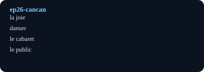

# La joie du cancan (The Joy of Cancan)

## Pourquoi ce nœud — explication
The cancan as working-class joy and tourist emblem: dance halls, high kicks, and Montmartre mythology. Core lesson: celebration vocabulary plus Paris-place names.
Focus: Dance / Montmartre / Belle Époque · Level A2–B1 · [[index-francais]]

## English synopsis (résumé en anglais)
The cancan as working-class joy and tourist emblem: dance halls, high kicks, and Montmartre mythology. Core lesson: celebration vocabulary plus Paris-place names.

## Idées clés
1. Cancan as subversion: dancers mocking bourgeois codes.
2. Montmartre as a stage: cabarets, posters, and nightlife economy.
3. Joy as discipline: kicks require athletic training.

## Point de grammaire
Expressing manner with adverbs in -ment (`joyeusement`, `rapidement`). — see also the linked grammar hub.

En bref: $$\text{rythme} = \frac{\text{coups de pied}}{\text{minute}}$$

## Extrait (transcript, 6 lignes)
| French | English | Notes |
|---|---|---|
| Depuis l'âge de quatre ans, je disais que je voulais être danseuse. J'avais une formation de danse classique, mais ma personnalité était tout l'opposé du classique ! J'avais trop d'énergie, et j'avais l'élégance d'un éléphant ! |  |  |
| J'avais pris toutes sortes de cours de danse. Je connaissais les danses de cabaret, les danses de salon… J'adorais les danses russes. Mais le cancan, c'était différent. Je n'avais jamais dansé le cancan ! |  |  |
| Je suis arrivée devant le directeur de la troupe. Il m'a demandé si je dansais le cancan. J'ai répondu : « Non ! » Ça l'a surpris. Il m'a demandé : « Alors, pourquoi tu es venue ? » J'ai répondu : « Pour essayer ! » J'étais très naïve. |  |  |
| Il m'a demandé : « Tu vas faire une diagonale en courant. Puis tu fais un grand écart, et tu glisses jusqu'au côté opposé de la salle. Tu es capable de faire ça ? » J'ai répondu : « C'est tout ? » J'avais beaucoup d'énergie. Pour moi, c'était facile ! |  |  |
| Ce n'était pas une vie classique, et ce n'était peut-être pas la vie que mes parents voulaient pour leur fille. Mais pour moi, choisir la danse, c'était choisir la joie, le bonheur. |  |  |
| Mes parents ne voulaient pas que je devienne danseuse professionnelle. Ils avaient peur de ce métier et du monde de la nuit. La nuit est un monde très dur. Ils avaient peut-être peur que je rencontre de mauvaises personnes. Ils avaient peur pour moi. |  |  |

## Vocabulaire clé
- **la joie** — joy (la joie du cancan)
- **danser** — to dance (la danseuse)
- **le cabaret** — cabaret (Montmartre halls)
- **le public** — audience (masculine)

## Flashcards (source — synced to Flashcards tab by course `French`)
| Front | Back | Hint |
|---|---|---|
| la joie | joy | la joie du cancan |
| danser | to dance | la danseuse |
| le cabaret | cabaret | Montmartre halls |
| le public | audience | masculine |

## Liens
- [[ep17-jacques-brel]]
- [[ep67-french-gastronomy]]
- [[vocabulaire-fete]]

#french #podcast #dance #paris #lecture

## Practice — open in app
- [[quiz:2|Starter quiz: French podcast]]
- [[card:2|la baguette tradition]] · [[card:3|gagner / perdre]] · [[card:4|avoir le trac]]
- [[pdf:French-Reader-A2.pdf|French Reader booklet]] · [[pdf:French-Reader-A2.pdf#page=2|Reader p.2: boulangerie]]
