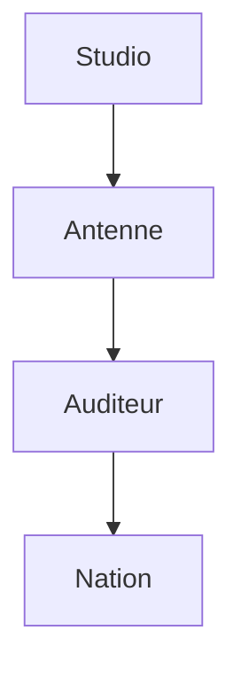
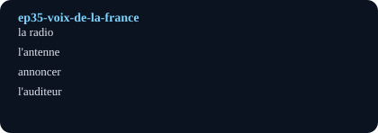

# La voix de la France (The Voice of France)

## Pourquoi ce nœud — explication
A broadcaster becomes 'the voice of France' in dark years: radio as company, news as hope. Core lesson: media vocabulary plus formal register.
Focus: Radio / war / national voice · Level A2–B1 · [[index-francais]]

## English synopsis (résumé en anglais)
A broadcaster becomes 'the voice of France' in dark years: radio as company, news as hope. Core lesson: media vocabulary plus formal register.

## Idées clés
1. Radio as companion: voices that keep isolated listeners going.
2. Speaking under pressure: clarity, calm, and careful words.
3. National symbols: how one voice can stand for a country.

## Point de grammaire
Reported speech in the past (`il a annoncé que…`, agreement of tenses). — see also the linked grammar hub.

En bref: $$\text{confiance} = \frac{\text{clarté}}{\text{bruit}}$$

## Extrait (transcript, 6 lignes)
| French | English | Notes |
|---|---|---|
| Je n'étais pas très bonne élève et je n'étais pas très sûre de moi. J'aimais la littérature et les auteurs français comme Molière, ou Maupassant. Mais en classe, je restais souvent silencieuse. J'avais peur de faire des erreurs. |  |  |
| J'avais un peu peur, mais j'ai commencé à réciter le poème devant ma classe de français. Pendant que je récitais, j'ai senti quelque chose changer dans la salle de classe. Les autres élèves et la professeure me regardaient et m'écoutaient en silence. |  |  |
| Ma professeure a dit : « C'était merveilleux ! » Je n'oublierai jamais ces mots. Je n'avais pas beaucoup de confiance en moi, alors le compliment de la prof était important pour moi. |  |  |
| Mes parents m'ont répondu : « Passe ton bac d'abord. » Je voulais faire plaisir à mes parents, alors j'ai passé mon bac et j'ai abandonné l'idée de devenir comédienne. |  |  |
| En fait, je n'avais pas assez confiance en moi. Je ne savais pas que j'étais capable d'offrir quelque chose au monde. |  |  |
| Male voice:   Loin de tous ces prétextes, le motif, c'est d'avoir défendu des idées… |  |  |

## Vocabulaire clé
- **la radio** — radio (feminine)
- **l'antenne** — airwaves (prendre l'antenne)
- **annoncer** — to announce (le journal)
- **l'auditeur** — listener (l'auditrice)

## Flashcards (source — synced to Flashcards tab by course `French`)
| Front | Back | Hint |
|---|---|---|
| la radio | radio | feminine |
| l'antenne | airwaves | prendre l'antenne |
| annoncer | to announce | le journal |
| l'auditeur | listener | l'auditrice |

## Liens
- [[ep22-chanson-revolutionnaire]]
- [[ep43-black-paris]]
- [[vocabulaire-medias]]

#french #podcast #media #history #lecture

## Practice — open in app
- [[quiz:2|Starter quiz: French podcast]]
- [[card:2|la baguette tradition]] · [[card:3|gagner / perdre]] · [[card:4|avoir le trac]]
- [[pdf:French-Reader-A2.pdf|French Reader booklet]] · [[pdf:French-Reader-A2.pdf#page=2|Reader p.2: boulangerie]]
