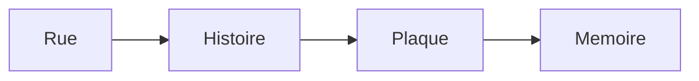

# Une visite guidée du Paris noir (A Tour of Black Paris)

## Pourquoi ce nœud — explication
A walking tour of Black Paris recovers erased addresses: writers, musicians, and soldiers the plaques forgot. Core lesson: city vocabulary plus commemoration language.
Focus: Paris / memory / guided tours · Level A2–B1 · [[index-francais]]

## English synopsis (résumé en anglais)
A walking tour of Black Paris recovers erased addresses: writers, musicians, and soldiers the plaques forgot. Core lesson: city vocabulary plus commemoration language.

## Idées clés
1. Guided tours as counter-history: who gets a plaque and who doesn't.
2. Paris as a palimpsest: layers of migration in one street.
3. Memory work: naming, listing, and walking as study methods.

## Point de grammaire
Locating in space (`au coin de`, `en face de`, `le long de`). — see also the linked grammar hub.

En bref: $$\text{ville} = \bigcup \text{quartiers}$$

## Extrait (transcript, 6 lignes)
| French | English | Notes |
|---|---|---|
| Bonjour Ngofeen ! Bonjour tout le monde ! |  |  |
| Je m'appelle Kévi Donat. Je suis guide touristique et je vais vous faire découvrir une autre histoire de Paris. Loin des clichés de carte postale, c'est l'histoire du Paris noir. |  |  |
| Paris a une histoire riche et internationale. Le monde entier se rencontre à Paris, et surtout le monde noir ! Mais on connaît peu cette histoire parce que les guides touristiques en parlent rarement. |  |  |
| Suivez-moi… Je vais vous faire découvrir une histoire cachée de Paris. |  |  |
| Le Quartier latin, c'est là où se trouvent toutes les universités, comme l'université de la Sorbonne. Il y a aussi les meilleurs lycées de France, des bibliothèques, et beaucoup de librairies. C'est le quartier des étudiants et des intellectuels. |  |  |
| Regardez bien ce monument devant nous. C'est un endroit important dans l'histoire de la France, et dans l'histoire du Paris noir. |  |  |

## Vocabulaire clé
- **la visite guidée** — guided tour (title phrase)
- **la mémoire** — memory (lieux de mémoire)
- **le quartier** — neighborhood (Paris districts)
- **rendre hommage** — to pay tribute (fixed expression)

## Flashcards (source — synced to Flashcards tab by course `French`)
| Front | Back | Hint |
|---|---|---|
| la visite guidée | guided tour | title phrase |
| la mémoire | memory | lieux de mémoire |
| le quartier | neighborhood | Paris districts |
| rendre hommage | to pay tribute | fixed expression |

## Liens
- [[ep35-voix-de-la-france]]
- [[ep22-chanson-revolutionnaire]]
- [[vocabulaire-ville]]

#french #podcast #paris #memory #lecture

## Practice — open in app
- [[quiz:2|Starter quiz: French podcast]]
- [[card:2|la baguette tradition]] · [[card:3|gagner / perdre]] · [[card:4|avoir le trac]]
- [[pdf:French-Reader-A2.pdf|French Reader booklet]] · [[pdf:French-Reader-A2.pdf#page=2|Reader p.2: boulangerie]]
