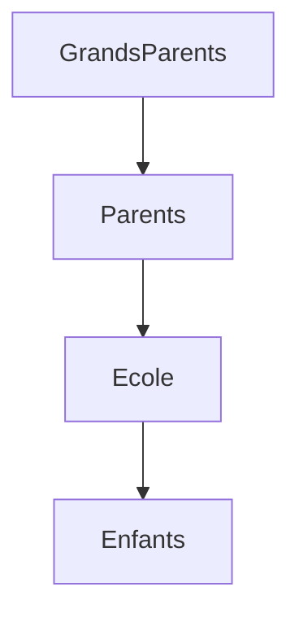
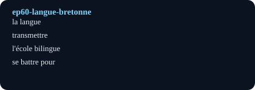

# Sauver la langue bretonne (Saving the Breton Language)

## Pourquoi ce nœud — explication
Saving Breton: grandparents who hid it, parents who lost it, children who reclaim it in bilingual schools. Core lesson: language-policy vocabulary plus the reflexive verbs of learning.
Focus: Language / Breton / transmission · Level A2–B1 · [[index-francais]]

## English synopsis (résumé en anglais)
Saving Breton: grandparents who hid it, parents who lost it, children who reclaim it in bilingual schools. Core lesson: language-policy vocabulary plus the reflexive verbs of learning.

## Idées clés
1. Shame to pride: how a language goes underground, then returns.
2. Schools (Diwan) as lifeboats: immersion as a rescue method.
3. Everyday transmission: songs, footers, and market conversations.

## Point de grammaire
Reflexive verbs of learning (`s'inscrire`, `se tromper`, `s'entraîner`). — see also the linked grammar hub.

En bref: $$L_{t+1} = L_t + \text{immersion} - \text{honte}$$

## Extrait (transcript, 6 lignes)
| French | English | Notes |
|---|---|---|
| Quand je suis devenue maman, beaucoup de choses ont changé. Je voulais vraiment trouver ma vocation. J'étais douée en langues alors j'ai étudié l'anglais, l'italien et le grec. Je pensais devenir professeure de langues. |  |  |
| J'ai toujours pensé que c'était super de connaître plusieurs langues quand on est petit. Pour moi, ça n'avait pas d'importance que ce soit du breton ou une autre langue. Alors j'ai inscrit ma fille dans l'école qui donnait des cours en breton. |  |  |

## Vocabulaire clé
- **la langue** — language/tongue (la langue bretonne)
- **transmettre** — to pass on (la transmission)
- **l'école bilingue** — bilingual school (Diwan schools)
- **se battre pour** — to fight for (reflexive + pour)

## Flashcards (source — synced to Flashcards tab by course `French`)
| Front | Back | Hint |
|---|---|---|
| la langue | language/tongue | la langue bretonne |
| transmettre | to pass on | la transmission |
| l'école bilingue | bilingual school | Diwan schools |
| se battre pour | to fight for | reflexive + pour |

## Liens
- [[ep09-soccer-power]]
- [[grammaire-verbes-pronominaux]]
- [[vocabulaire-langues]]

#french #podcast #language #brittany #lecture

## Practice — open in app
- [[quiz:2|Starter quiz: French podcast]]
- [[card:2|la baguette tradition]] · [[card:3|gagner / perdre]] · [[card:4|avoir le trac]]
- [[pdf:French-Reader-A2.pdf|French Reader booklet]] · [[pdf:French-Reader-A2.pdf#page=2|Reader p.2: boulangerie]]
