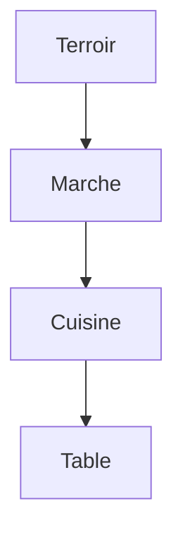
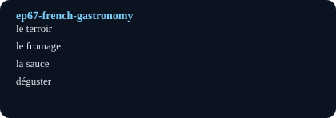

# Traditions iconiques - French Gastronomy

## Pourquoi ce nœud — explication
French gastronomy as edible ritual: courses, cheeses, sauces, and the long lunch. Core lesson: food vocabulary plus the art of the menu.
Focus: Food / gastronomy / ritual · Level A2–B1 · [[index-francais]]

## English synopsis (résumé en anglais)
French gastronomy as edible ritual: courses, cheeses, sauces, and the long lunch. Core lesson: food vocabulary plus the art of the menu.

## Idées clés
1. The meal as ceremony: order of courses and table manners.
2. Terroir: why place names taste like something.
3. From bakery to table: bread as the quiet backbone (see ep01).

## Point de grammaire
Partitives (`du`, `de la`, `des`) for tasting and ordering. — see also the linked grammar hub.

En bref: $$\text{repas} = \text{entrée} + \text{plat} + \text{fromage} + \text{dessert}$$

## Extrait (transcript, 6 lignes)
| French | English | Notes |
|---|---|---|
| Tout de suite, on sent que c'est une occasion spéciale. Mes parents et moi avons mis nos plus beaux vêtements, et nos chaussures brillent. Je suis un peu mal à l'aise, mais je sais que ça va être un repas très spécial. |  |  |
| Le confit de pigeon est merveilleux… Les plats ne sont pas très copieux, mais ils sont délicieux. Ils sont bien cuits, et la température est parfaite. Même la présentation est superbe ! C'est à ce moment-là que je comprends que j'aime la gastronomie. Un repas gastronomique, c'est un art. Et je veux participer à cet art. |  |  |
| Je n'ai jamais mangé comme ça. Je trouve ça extraordinaire. Et je me dis : « Si j'obtiens ce travail, je pourrai bientôt créer des repas gastronomiques comme celui-ci ! ». |  |  |
| En France, nous avons une longue tradition : nous aimons partager de grands repas. Même les rois servaient des banquets très élaborés. Plusieurs plats se suivaient : charcuterie, soupes, viandes, fromages, desserts, et fruits. Et aujourd'hui, la France est le pays où les gens passent le plus de temps à table. |  |  |
| Dans un repas français, on sert souvent une entrée, un plat principal, mais aussi du fromage, de la salade, et un dessert. Sans oublier le vin, et à la fin, le café. |  |  |
| Le repas gastronomique, c'est souvent pour une occasion spéciale comme un anniversaire, un mariage, ou une première communion. Même les gens qui ne vont pas souvent au restaurant économisent pour pouvoir se payer un repas gastronomique. C'est un très long repas : on passe trois ou quatre heures à table. C'est une histoire de partage, avec des amis, ou des membres de la famille. |  |  |

## Vocabulaire clé
- **le terroir** — terroir/local soil (goût du terroir)
- **le fromage** — cheese (plateau de fromages)
- **la sauce** — sauce (sauces mères)
- **déguster** — to taste/savor (dégustation)

## Flashcards (source — synced to Flashcards tab by course `French`)
| Front | Back | Hint |
|---|---|---|
| le terroir | terroir/local soil | goût du terroir |
| le fromage | cheese | plateau de fromages |
| la sauce | sauce | sauces mères |
| déguster | to taste/savor | dégustation |

## Liens
- [[ep01-baguette-magician]]
- [[ep66-parfum]]
- [[vocabulaire-cuisine]]

#french #podcast #food #ritual #lecture

## Practice — open in app
- [[quiz:2|Starter quiz: French podcast]]
- [[card:2|la baguette tradition]] · [[card:3|gagner / perdre]] · [[card:4|avoir le trac]]
- [[pdf:French-Reader-A2.pdf|French Reader booklet]] · [[pdf:French-Reader-A2.pdf#page=2|Reader p.2: boulangerie]]
