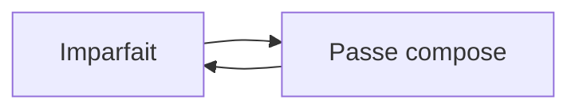

# Grammaire — Passé composé / Imparfait

## Explication
- **Imparfait** = décor and habits: `je conduisais`, `j'étais content`.
- **Passé composé** = events that move the story: `j'ai gagné`, `on m'a appelé`.
- Signal words: `tous les jours` → imparfait; `soudain`, `ce jour-là` → passé composé.

La règle d'or: $$\text{récit} = \text{décor (imparfait)} + \text{événements (passé composé)}$$

Related: [[ep01-baguette-magician]] · #french #grammaire

