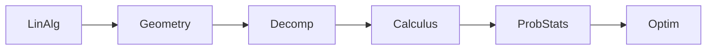

# Mathematics for Machine Learning (MML Book)

## Pourquoi ce nœud — explication
The mathematical foundations bible: linear algebra, analytic geometry, matrix decompositions, vector calculus, probability, and optimization — everything the rest of this cluster assumes. Read this first when a formula elsewhere (chain rule, Jacobians, eigen-things) feels shaky.

Source file: `mml-book.pdf` · [[index-research]]

En bref: $$\mathbf{A} = \mathbf{U}\mathbf{\Sigma}\mathbf{V}^\top$$

## Contents (104 sections — every entry links somewhere)
- [[research/mml-book/1-1-finding-words-for-intuitions|1 1 finding words for intuitions]]
- [[research/mml-book/1-2-two-ways-to-read-this-book|1 2 two ways to read this book]]
- [[research/mml-book/1-3-exercises-and-feedback|1 3 exercises and feedback]]
- [[research/mml-book/1-introduction-and-motivation|1 introduction and motivation]]
- [[research/mml-book/10-1-problem-setting|10 1 problem setting]]
- [[research/mml-book/10-2-maximum-variance-perspective|10 2 maximum variance perspective]]
- [[research/mml-book/10-3-projection-perspective|10 3 projection perspective]]
- [[research/mml-book/10-4-eigenvector-computation-and-low-rank-approximations|10 4 eigenvector computation and low rank approximations]]
- [[research/mml-book/10-5-pca-in-high-dimensions|10 5 pca in high dimensions]]
- [[research/mml-book/10-6-key-steps-of-pca-in-practice|10 6 key steps of pca in practice]]
- [[research/mml-book/10-7-latent-variable-perspective|10 7 latent variable perspective]]
- [[research/mml-book/10-8-further-reading|10 8 further reading]]
- [[research/mml-book/10-dimensionality-reduction-with-principal-component-analysis|10 dimensionality reduction with principal component analysis]]
- [[research/mml-book/11-1-gaussian-mixture-model|11 1 gaussian mixture model]]
- [[research/mml-book/11-2-parameter-learning-via-maximum-likelihood|11 2 parameter learning via maximum likelihood]]
- [[research/mml-book/11-3-em-algorithm|11 3 em algorithm]]
- [[research/mml-book/11-4-latent-variable-perspective|11 4 latent variable perspective]]
- [[research/mml-book/11-5-further-reading|11 5 further reading]]
- [[research/mml-book/11-density-estimation-with-gaussian-mixture-models|11 density estimation with gaussian mixture models]]
- [[research/mml-book/12-1-separating-hyperplanes|12 1 separating hyperplanes]]
- [[research/mml-book/12-2-primal-support-vector-machine|12 2 primal support vector machine]]
- [[research/mml-book/12-3-dual-support-vector-machine|12 3 dual support vector machine]]
- [[research/mml-book/12-4-kernels|12 4 kernels]]
- [[research/mml-book/12-5-numerical-solution|12 5 numerical solution]]
- [[research/mml-book/12-6-further-reading|12 6 further reading]]
- [[research/mml-book/12-classification-with-support-vector-machines|12 classification with support vector machines]]
- [[research/mml-book/2-1-systems-of-linear-equations|2 1 systems of linear equations]]
- [[research/mml-book/2-2-matrices|2 2 matrices]]
- [[research/mml-book/2-3-solving-systems-of-linear-equations|2 3 solving systems of linear equations]]
- [[research/mml-book/2-4-vector-spaces|2 4 vector spaces]]
- [[research/mml-book/2-5-linear-independence|2 5 linear independence]]
- [[research/mml-book/2-6-basis-and-rank|2 6 basis and rank]]
- [[research/mml-book/2-7-linear-mappings|2 7 linear mappings]]
- [[research/mml-book/2-8-affine-spaces|2 8 affine spaces]]
- [[research/mml-book/2-9-further-reading|2 9 further reading]]
- [[research/mml-book/2-linear-algebra|2 linear algebra]]
- [[research/mml-book/3-1-norms|3 1 norms]]
- [[research/mml-book/3-10-further-reading|3 10 further reading]]
- [[research/mml-book/3-2-inner-products|3 2 inner products]]
- [[research/mml-book/3-3-lengths-and-distances|3 3 lengths and distances]]
- [[research/mml-book/3-4-angles-and-orthogonality|3 4 angles and orthogonality]]
- [[research/mml-book/3-5-orthonormal-basis|3 5 orthonormal basis]]
- [[research/mml-book/3-6-orthogonal-complement|3 6 orthogonal complement]]
- [[research/mml-book/3-7-inner-product-of-functions|3 7 inner product of functions]]
- [[research/mml-book/3-8-orthogonal-projections|3 8 orthogonal projections]]
- [[research/mml-book/3-9-rotations|3 9 rotations]]
- [[research/mml-book/3-analytic-geometry|3 analytic geometry]]
- [[research/mml-book/4-1-determinant-and-trace|4 1 determinant and trace]]
- [[research/mml-book/4-2-eigenvalues-and-eigenvectors|4 2 eigenvalues and eigenvectors]]
- [[research/mml-book/4-3-cholesky-decomposition|4 3 cholesky decomposition]]
- [[research/mml-book/4-4-eigendecomposition-and-diagonalization|4 4 eigendecomposition and diagonalization]]
- [[research/mml-book/4-5-singular-value-decomposition|4 5 singular value decomposition]]
- [[research/mml-book/4-6-matrix-approximation|4 6 matrix approximation]]
- [[research/mml-book/4-7-matrix-phylogeny|4 7 matrix phylogeny]]
- [[research/mml-book/4-8-further-reading|4 8 further reading]]
- [[research/mml-book/4-matrix-decompositions|4 matrix decompositions]]
- [[research/mml-book/5-1-differentiation-of-univariate-functions|5 1 differentiation of univariate functions]]
- [[research/mml-book/5-2-partial-differentiation-and-gradients|5 2 partial differentiation and gradients]]
- [[research/mml-book/5-3-gradients-of-vector-valued-functions|5 3 gradients of vector valued functions]]
- [[research/mml-book/5-4-gradients-of-matrices|5 4 gradients of matrices]]
- [[research/mml-book/5-5-useful-identities-for-computing-gradients|5 5 useful identities for computing gradients]]
- [[research/mml-book/5-6-backpropagation-and-automatic-differentiation|5 6 backpropagation and automatic differentiation]]
- [[research/mml-book/5-7-higher-order-derivatives|5 7 higher order derivatives]]
- [[research/mml-book/5-8-linearization-and-multivariate-taylor-series|5 8 linearization and multivariate taylor series]]
- [[research/mml-book/5-9-further-reading|5 9 further reading]]
- [[research/mml-book/5-vector-calculus|5 vector calculus]]
- [[research/mml-book/6-1-construction-of-a-probability-space|6 1 construction of a probability space]]
- [[research/mml-book/6-2-discrete-and-continuous-probabilities|6 2 discrete and continuous probabilities]]
- [[research/mml-book/6-3-sum-rule-product-rule-and-bayes-theorem|6 3 sum rule product rule and bayes theorem]]
- [[research/mml-book/6-4-summary-statistics-and-independence|6 4 summary statistics and independence]]
- [[research/mml-book/6-5-gaussian-distribution|6 5 gaussian distribution]]
- [[research/mml-book/6-6-conjugacy-and-the-exponential-family|6 6 conjugacy and the exponential family]]
- [[research/mml-book/6-7-change-of-variables-inverse-transform|6 7 change of variables inverse transform]]
- [[research/mml-book/6-8-further-reading|6 8 further reading]]
- [[research/mml-book/6-probability-and-distributions|6 probability and distributions]]
- [[research/mml-book/7-1-optimization-using-gradient-descent|7 1 optimization using gradient descent]]
- [[research/mml-book/7-2-constrained-optimization-and-lagrange-multipliers|7 2 constrained optimization and lagrange multipliers]]
- [[research/mml-book/7-3-convex-optimization|7 3 convex optimization]]
- [[research/mml-book/7-4-further-reading|7 4 further reading]]
- [[research/mml-book/7-continuous-optimization|7 continuous optimization]]
- [[research/mml-book/8-1-data-models-and-learning|8 1 data models and learning]]
- [[research/mml-book/8-2-empirical-risk-minimization|8 2 empirical risk minimization]]
- [[research/mml-book/8-3-parameter-estimation|8 3 parameter estimation]]
- [[research/mml-book/8-4-probabilistic-modeling-and-inference|8 4 probabilistic modeling and inference]]
- [[research/mml-book/8-5-directed-graphical-models|8 5 directed graphical models]]
- [[research/mml-book/8-6-model-selection|8 6 model selection]]
- [[research/mml-book/8-when-models-meet-data|8 when models meet data]]
- [[research/mml-book/9-1-problem-formulation|9 1 problem formulation]]
- [[research/mml-book/9-2-parameter-estimation|9 2 parameter estimation]]
- [[research/mml-book/9-3-bayesian-linear-regression|9 3 bayesian linear regression]]
- [[research/mml-book/9-4-maximum-likelihood-as-orthogonal-projection|9 4 maximum likelihood as orthogonal projection]]
- [[research/mml-book/9-5-further-reading|9 5 further reading]]
- [[research/mml-book/9-linear-regression|9 linear regression]]
- [[research/mml-book/exercises-2|exercises 2]]
- [[research/mml-book/exercises-3|exercises 3]]
- [[research/mml-book/exercises-4|exercises 4]]
- [[research/mml-book/exercises-5|exercises 5]]
- [[research/mml-book/exercises-6|exercises 6]]
- [[research/mml-book/exercises|exercises]]
- [[research/mml-book/foreword|foreword]]
- [[research/mml-book/index|index]]
- [[research/mml-book/part-i-mathematical-foundations|part i mathematical foundations]]
- [[research/mml-book/part-ii-central-machine-learning-problems|part ii central machine learning problems]]
- [[research/mml-book/references|references]]

## Practice — open in app
- [[pdf:mml-book.pdf|Open mml-book.pdf]]
- [[quiz:3|ML starter quiz]]

## Liens
- [[matrix-calculus]]
- [[index-research]]

#ml #math #foundations #book #research #lecture
