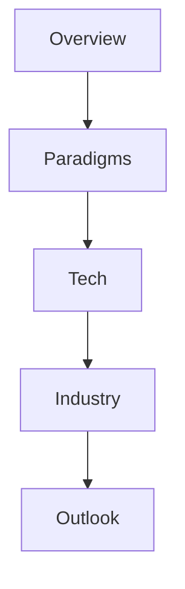

# RAG: Paradigms, Technologies, Trends (Slide Deck)

## Pourquoi ce nœud — explication
The 30-minute overview version: RAG paradigms and trends as slides (mostly figures, little extractable text). Skim this for the map, then go deep in the Haystack guide.

Source file: `RAG_Slide_ENG.pdf` · [[index-research]]

En bref: $$\text{query} \rightarrow \text{retriever} \rightarrow \text{reader}$$

## Contents (24 sections — every entry links somewhere)
- [[research/rag-slides/slide-1-pp-4-4|slide 1 pp 4 4]]
- [[research/rag-slides/slide-10-pp-17-17|slide 10 pp 17 17]]
- [[research/rag-slides/slide-11-pp-20-20|slide 11 pp 20 20]]
- [[research/rag-slides/slide-12-pp-21-21|slide 12 pp 21 21]]
- [[research/rag-slides/slide-13-pp-22-22|slide 13 pp 22 22]]
- [[research/rag-slides/slide-14-pp-23-23|slide 14 pp 23 23]]
- [[research/rag-slides/slide-15-pp-25-25|slide 15 pp 25 25]]
- [[research/rag-slides/slide-16-pp-26-26|slide 16 pp 26 26]]
- [[research/rag-slides/slide-17-pp-27-27|slide 17 pp 27 27]]
- [[research/rag-slides/slide-18-pp-29-29|slide 18 pp 29 29]]
- [[research/rag-slides/slide-19-pp-31-31|slide 19 pp 31 31]]
- [[research/rag-slides/slide-2-pp-5-5|slide 2 pp 5 5]]
- [[research/rag-slides/slide-20-pp-35-35|slide 20 pp 35 35]]
- [[research/rag-slides/slide-21-pp-36-36|slide 21 pp 36 36]]
- [[research/rag-slides/slide-22-pp-38-38|slide 22 pp 38 38]]
- [[research/rag-slides/slide-23-pp-39-39|slide 23 pp 39 39]]
- [[research/rag-slides/slide-24-pp-40-40|slide 24 pp 40 40]]
- [[research/rag-slides/slide-3-pp-8-8|slide 3 pp 8 8]]
- [[research/rag-slides/slide-4-pp-10-10|slide 4 pp 10 10]]
- [[research/rag-slides/slide-5-pp-11-11|slide 5 pp 11 11]]
- [[research/rag-slides/slide-6-pp-12-12|slide 6 pp 12 12]]
- [[research/rag-slides/slide-7-pp-14-14|slide 7 pp 14 14]]
- [[research/rag-slides/slide-8-pp-15-15|slide 8 pp 15 15]]
- [[research/rag-slides/slide-9-pp-16-16|slide 9 pp 16 16]]

## Practice — open in app
- [[pdf:RAG_Slide_ENG.pdf|Open RAG_Slide_ENG.pdf]]
- [[quiz:3|ML starter quiz]]

## Liens
- [[rag-haystack-guide]]
- [[index-research]]

#rag #slides #overview #research #lecture
