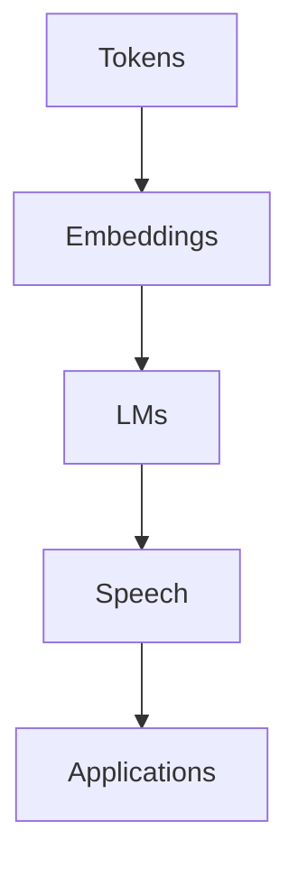

# Speech and Language Processing (Jurafsky & Martin, 3rd ed. draft)

## Pourquoi ce nœud — explication
The big NLP survey: tokens, embeddings, language models, and speech, now rewritten around large language models. The parent of the Chapter 11 node — open that for the retrieval/RAG-adjacent slice, this for the full map of the field.

Source file: `Speech and Language Processing.pdf` · [[index-research]]

En bref: $$P(w_1, \ldots, w_n) = \prod_{i=1}^{n} P(w_i \mid w_{<i})$$

## Contents (485 sections — every entry links somewhere)
- [[research/slp/a-feature-based-algorithm-for-assigning-scores|a feature based algorithm for assigning scores]]
- [[research/slp/a-feature-based-algorithm-for-semantic-role-labeling|a feature based algorithm for semantic role labeling]]
- [[research/slp/a-feature-based-classifier|a feature based classifier]]
- [[research/slp/a-neural-algorithm-for-assigning-scores|a neural algorithm for assigning scores]]
- [[research/slp/a-neural-algorithm-for-semantic-role-labeling|a neural algorithm for semantic role labeling]]
- [[research/slp/a-neural-classifier|a neural classifier]]
- [[research/slp/a-neural-mention-ranking-algorithm|a neural mention ranking algorithm]]
- [[research/slp/a-simple-example|a simple example]]
- [[research/slp/acoustic-phonetics-and-signals|acoustic phonetics and signals]]
- [[research/slp/add-k-smoothing|add k smoothing]]
- [[research/slp/advanced-deriving-the-gradient-equation|advanced deriving the gradient equation]]
- [[research/slp/advanced-methods-in-transition-based-parsing|advanced methods in transition based parsing]]
- [[research/slp/advanced-perplexity-s-relation-to-entropy|advanced perplexity s relation to entropy]]
- [[research/slp/advanced-regularization|advanced regularization]]
- [[research/slp/ambiguity|ambiguity]]
- [[research/slp/anchors-and-boundaries|anchors and boundaries]]
- [[research/slp/applying-softmax-in-logistic-regression|applying softmax in logistic regression]]
- [[research/slp/architectures-for-coreference-algorithms|architectures for coreference algorithms]]
- [[research/slp/argumentation-structure|argumentation structure]]
- [[research/slp/articulatory-phonetics|articulatory phonetics]]
- [[research/slp/asr-evaluation-word-error-rate|asr evaluation word error rate]]
- [[research/slp/attention-2|attention 2]]
- [[research/slp/attention-more-formally|attention more formally]]
- [[research/slp/attention|attention]]
- [[research/slp/automatic-evaluation-embedding-based-methods|automatic evaluation embedding based methods]]
- [[research/slp/automatic-evaluation|automatic evaluation]]
- [[research/slp/automatic-speech-recognition|automatic speech recognition]]
- [[research/slp/automatic-temporal-analysis|automatic temporal analysis]]
- [[research/slp/available-sentiment-and-affect-lexicons|available sentiment and affect lexicons]]
- [[research/slp/avoiding-harms-in-classification|avoiding harms in classification]]
- [[research/slp/backward-differentiation-on-computation-graphs|backward differentiation on computation graphs]]
- [[research/slp/bias-and-embeddings|bias and embeddings]]
- [[research/slp/bias-and-ethical-issues|bias and ethical issues]]
- [[research/slp/bibliography|bibliography]]
- [[research/slp/bidirectional-rnns|bidirectional rnns]]
- [[research/slp/bidirectional-transformer-encoders|bidirectional transformer encoders]]
- [[research/slp/bio-tagging|bio tagging]]
- [[research/slp/bpe-encoder|bpe encoder]]
- [[research/slp/bpe-in-practice|bpe in practice]]
- [[research/slp/bpe-training|bpe training]]
- [[research/slp/centering-and-entity-based-coherence|centering and entity based coherence]]
- [[research/slp/centering|centering]]
- [[research/slp/chain-of-thought-prompting|chain of thought prompting]]
- [[research/slp/character-disjunction-the-square-bracket|character disjunction the square bracket]]
- [[research/slp/cky-in-practice|cky in practice]]
- [[research/slp/cky-parsing-a-dynamic-programming-approach|cky parsing a dynamic programming approach]]
- [[research/slp/cky-parsing|cky parsing]]
- [[research/slp/cky-recognition|cky recognition]]
- [[research/slp/classification-with-logistic-regression|classification with logistic regression]]
- [[research/slp/classifiers-using-hand-built-features|classifiers using hand built features]]
- [[research/slp/code-points|code points]]
- [[research/slp/coherence-relations|coherence relations]]
- [[research/slp/combining-ctc-and-encoder-decoder|combining ctc and encoder decoder]]
- [[research/slp/complications-non-referring-expressions|complications non referring expressions]]
- [[research/slp/computation-graphs|computation graphs]]
- [[research/slp/computing-scores-for-a-span|computing scores for a span]]
- [[research/slp/computing-span-representations|computing span representations]]
- [[research/slp/computing-the-gradient|computing the gradient]]
- [[research/slp/computing-the-mention-and-antecedent-scores-m-and-c|computing the mention and antecedent scores m and c]]
- [[research/slp/conditional-generation-of-text-the-intuition|conditional generation of text the intuition]]
- [[research/slp/conditional-random-fields-crfs|conditional random fields crfs]]
- [[research/slp/connotation-frames|connotation frames]]
- [[research/slp/constituency|constituency]]
- [[research/slp/context-free-grammars-and-constituency-parsing|context free grammars and constituency parsing]]
- [[research/slp/context-free-grammars|context free grammars]]
- [[research/slp/contextual-embeddings-and-word-sense|contextual embeddings and word sense]]
- [[research/slp/contextual-embeddings-and-word-similarity|contextual embeddings and word similarity]]
- [[research/slp/contextual-embeddings|contextual embeddings]]
- [[research/slp/conversation-and-its-structure|conversation and its structure]]
- [[research/slp/conversion-to-chomsky-normal-form|conversion to chomsky normal form]]
- [[research/slp/convolutional-neural-networks|convolutional neural networks]]
- [[research/slp/coreference-phenomena-linguistic-background|coreference phenomena linguistic background]]
- [[research/slp/coreference-resolution-and-entity-linking|coreference resolution and entity linking]]
- [[research/slp/coreference-tasks-and-datasets|coreference tasks and datasets]]
- [[research/slp/corpora|corpora]]
- [[research/slp/cosine-for-measuring-similarity|cosine for measuring similarity]]
- [[research/slp/counting-optionality-and-wildcards|counting optionality and wildcards]]
- [[research/slp/creating-affect-lexicons-by-human-labeling|creating affect lexicons by human labeling]]
- [[research/slp/creating-an-oracle|creating an oracle]]
- [[research/slp/creating-the-training-data|creating the training data]]
- [[research/slp/ctc-inference|ctc inference]]
- [[research/slp/ctc-training|ctc training]]
- [[research/slp/ctc|ctc]]
- [[research/slp/data-augmentation|data augmentation]]
- [[research/slp/datasets|datasets]]
- [[research/slp/dealing-with-scale-in-large-n-gram-models|dealing with scale in large n gram models]]
- [[research/slp/dealing-with-scale|dealing with scale]]
- [[research/slp/decoding-in-mt-beam-search|decoding in mt beam search]]
- [[research/slp/defining-emotion|defining emotion]]
- [[research/slp/dependency-formalisms|dependency formalisms]]
- [[research/slp/dependency-parsing|dependency parsing]]
- [[research/slp/dependency-relations|dependency relations]]
- [[research/slp/dependency-treebanks|dependency treebanks]]
- [[research/slp/details-of-the-encoder-decoder-model|details of the encoder decoder model]]
- [[research/slp/dialog-acts-and-corpora|dialog acts and corpora]]
- [[research/slp/diathesis-alternations|diathesis alternations]]
- [[research/slp/direct-preference-optimization|direct preference optimization]]
- [[research/slp/discourse-coherence|discourse coherence]]
- [[research/slp/discourse-structure-parsing|discourse structure parsing]]
- [[research/slp/discrete-fourier-transform|discrete fourier transform]]
- [[research/slp/disjunction-grouping-and-precedence|disjunction grouping and precedence]]
- [[research/slp/distant-supervision-for-relation-extraction|distant supervision for relation extraction]]
- [[research/slp/document-scoring|document scoring]]
- [[research/slp/downstream-tasks-reasoning-and-world-knowledge|downstream tasks reasoning and world knowledge]]
- [[research/slp/earlier-finite-state-template-filling-systems|earlier finite state template filling systems]]
- [[research/slp/edu-segmentation-for-rst-parsing|edu segmentation for rst parsing]]
- [[research/slp/efficiently-finding-documents-the-inverted-index|efficiently finding documents the inverted index]]
- [[research/slp/embeddings-and-historical-semantics|embeddings and historical semantics]]
- [[research/slp/embeddings-as-the-input-to-neural-net-classifiers|embeddings as the input to neural net classifiers]]
- [[research/slp/embeddings|embeddings]]
- [[research/slp/entity-based-models|entity based models]]
- [[research/slp/entity-grid-model|entity grid model]]
- [[research/slp/entity-linking|entity linking]]
- [[research/slp/ethical-and-safety-issues-with-language-models|ethical and safety issues with language models]]
- [[research/slp/evaluating-language-models-perplexity|evaluating language models perplexity]]
- [[research/slp/evaluating-language-models-training-and-test-sets|evaluating language models training and test sets]]
- [[research/slp/evaluating-large-language-models|evaluating large language models]]
- [[research/slp/evaluating-named-entity-recognition|evaluating named entity recognition]]
- [[research/slp/evaluating-neural-and-entity-based-coherence|evaluating neural and entity based coherence]]
- [[research/slp/evaluating-parsers|evaluating parsers]]
- [[research/slp/evaluating-question-answering|evaluating question answering]]
- [[research/slp/evaluating-vector-models|evaluating vector models]]
- [[research/slp/evaluating-with-more-than-two-classes|evaluating with more than two classes]]
- [[research/slp/evaluation-of-coreference-resolution|evaluation of coreference resolution]]
- [[research/slp/evaluation-of-information-retrieval-systems|evaluation of information retrieval systems]]
- [[research/slp/evaluation-of-instruction-tuned-models|evaluation of instruction tuned models]]
- [[research/slp/evaluation-of-named-entity-recognition|evaluation of named entity recognition]]
- [[research/slp/evaluation-of-preference-aligned-models|evaluation of preference aligned models]]
- [[research/slp/evaluation-of-relation-extraction|evaluation of relation extraction]]
- [[research/slp/evaluation-of-semantic-role-labeling|evaluation of semantic role labeling]]
- [[research/slp/evaluation-precision-recall-f-measure|evaluation precision recall f measure]]
- [[research/slp/evaluation|evaluation]]
- [[research/slp/exercises-10|exercises 10]]
- [[research/slp/exercises-11|exercises 11]]
- [[research/slp/exercises-12|exercises 12]]
- [[research/slp/exercises-13|exercises 13]]
- [[research/slp/exercises-14|exercises 14]]
- [[research/slp/exercises-15|exercises 15]]
- [[research/slp/exercises-16|exercises 16]]
- [[research/slp/exercises-17|exercises 17]]
- [[research/slp/exercises-2|exercises 2]]
- [[research/slp/exercises-3|exercises 3]]
- [[research/slp/exercises-4|exercises 4]]
- [[research/slp/exercises-5|exercises 5]]
- [[research/slp/exercises-6|exercises 6]]
- [[research/slp/exercises-7|exercises 7]]
- [[research/slp/exercises-8|exercises 8]]
- [[research/slp/exercises-9|exercises 9]]
- [[research/slp/exercises|exercises]]
- [[research/slp/extracting-events|extracting events]]
- [[research/slp/extracting-temporal-expressions|extracting temporal expressions]]
- [[research/slp/feature-extraction-for-speech-recognition-log-mel-spectrum|feature extraction for speech recognition log mel spectrum]]
- [[research/slp/features-for-crf-named-entity-recognizers|features for crf named entity recognizers]]
- [[research/slp/features-in-a-crf-pos-tagger|features in a crf pos tagger]]
- [[research/slp/features-in-multinomial-logistic-regression|features in multinomial logistic regression]]
- [[research/slp/feedforward-networks-for-nlp-classification|feedforward networks for nlp classification]]
- [[research/slp/feedforward-neural-networks|feedforward neural networks]]
- [[research/slp/fine-tuning-for-classification|fine tuning for classification]]
- [[research/slp/fine-tuning-for-sequence-labeling-named-entity-recognition|fine tuning for sequence labeling named entity recognition]]
- [[research/slp/finetuning|finetuning]]
- [[research/slp/formal-definition-of-context-free-grammar|formal definition of context free grammar]]
- [[research/slp/forward-inference-in-an-rnn-language-model|forward inference in an rnn language model]]
- [[research/slp/framenet|framenet]]
- [[research/slp/frequency-and-amplitude-pitch-and-loudness|frequency and amplitude pitch and loudness]]
- [[research/slp/further-details|further details]]
- [[research/slp/gated-units-layers-and-networks|gated units layers and networks]]
- [[research/slp/gender-bias-in-coreference|gender bias in coreference]]
- [[research/slp/generalizing-vs-overfitting-the-training-set|generalizing vs overfitting the training set]]
- [[research/slp/generation-and-sampling|generation and sampling]]
- [[research/slp/generation-with-rnn-based-language-models|generation with rnn based language models]]
- [[research/slp/global-coherence|global coherence]]
- [[research/slp/gradient-descent|gradient descent]]
- [[research/slp/grammar-equivalence-and-normal-form|grammar equivalence and normal form]]
- [[research/slp/graph-based-dependency-parsing|graph based dependency parsing]]
- [[research/slp/greedy-decoding|greedy decoding]]
- [[research/slp/grounding|grounding]]
- [[research/slp/heads-and-head-finding|heads and head finding]]
- [[research/slp/historical-notes-10|historical notes 10]]
- [[research/slp/historical-notes-11|historical notes 11]]
- [[research/slp/historical-notes-12|historical notes 12]]
- [[research/slp/historical-notes-13|historical notes 13]]
- [[research/slp/historical-notes-14|historical notes 14]]
- [[research/slp/historical-notes-15|historical notes 15]]
- [[research/slp/historical-notes-16|historical notes 16]]
- [[research/slp/historical-notes-17|historical notes 17]]
- [[research/slp/historical-notes-18|historical notes 18]]
- [[research/slp/historical-notes-19|historical notes 19]]
- [[research/slp/historical-notes-2|historical notes 2]]
- [[research/slp/historical-notes-20|historical notes 20]]
- [[research/slp/historical-notes-21|historical notes 21]]
- [[research/slp/historical-notes-22|historical notes 22]]
- [[research/slp/historical-notes-23|historical notes 23]]
- [[research/slp/historical-notes-3|historical notes 3]]
- [[research/slp/historical-notes-4|historical notes 4]]
- [[research/slp/historical-notes-5|historical notes 5]]
- [[research/slp/historical-notes-6|historical notes 6]]
- [[research/slp/historical-notes-7|historical notes 7]]
- [[research/slp/historical-notes-8|historical notes 8]]
- [[research/slp/historical-notes-9|historical notes 9]]
- [[research/slp/historical-notes|historical notes]]
- [[research/slp/hmm-part-of-speech-tagging|hmm part of speech tagging]]
- [[research/slp/hmm-tagging-as-decoding|hmm tagging as decoding]]
- [[research/slp/how-to-estimate-probabilities|how to estimate probabilities]]
- [[research/slp/hubert-forward-pass|hubert forward pass]]
- [[research/slp/i-large-language-models|i large language models]]
- [[research/slp/ii-annotating-linguistic-structure|ii annotating linguistic structure]]
- [[research/slp/in-context-learning-and-induction-heads|in context learning and induction heads]]
- [[research/slp/inference-and-implicature|inference and implicature]]
- [[research/slp/inference-and-training-for-crfs|inference and training for crfs]]
- [[research/slp/inference-in-rnns|inference in rnns]]
- [[research/slp/inference|inference]]
- [[research/slp/information-extraction-relations-events-and-time|information extraction relations events and time]]
- [[research/slp/information-retrieval-with-dense-vectors|information retrieval with dense vectors]]
- [[research/slp/information-retrieval|information retrieval]]
- [[research/slp/information-status|information status]]
- [[research/slp/initiative|initiative]]
- [[research/slp/input-and-convolutional-layers|input and convolutional layers]]
- [[research/slp/instruction-tuning|instruction tuning]]
- [[research/slp/instructions-as-training-data|instructions as training data]]
- [[research/slp/integrating-span-scores-into-a-parse|integrating span scores into a parse]]
- [[research/slp/interpretation-of-phones-from-a-waveform|interpretation of phones from a waveform]]
- [[research/slp/interpreting-models|interpreting models]]
- [[research/slp/interpreting-the-transformer|interpreting the transformer]]
- [[research/slp/introduction|introduction]]
- [[research/slp/k-means-clustering|k means clustering]]
- [[research/slp/kv-cache|kv cache]]
- [[research/slp/label-propagation|label propagation]]
- [[research/slp/language-divergences-and-typology|language divergences and typology]]
- [[research/slp/language-model-interpolation|language model interpolation]]
- [[research/slp/laplace-smoothing|laplace smoothing]]
- [[research/slp/large-language-models|large language models]]
- [[research/slp/learning-2|learning 2]]
- [[research/slp/learning-for-hubert|learning for hubert]]
- [[research/slp/learning-from-preferences|learning from preferences]]
- [[research/slp/learning-in-logistic-regression|learning in logistic regression]]
- [[research/slp/learning-in-multinomial-logistic-regression|learning in multinomial logistic regression]]
- [[research/slp/learning-skip-gram-embeddings|learning skip gram embeddings]]
- [[research/slp/learning-to-score-preferences|learning to score preferences]]
- [[research/slp/learning|learning]]
- [[research/slp/lexical-divergences|lexical divergences]]
- [[research/slp/lexical-semantics|lexical semantics]]
- [[research/slp/lexicon-based-methods-for-entity-centric-affect|lexicon based methods for entity centric affect]]
- [[research/slp/lexicons-for-sentiment-affect-and-connotation|lexicons for sentiment affect and connotation]]
- [[research/slp/limitations-of-preference-based-learning|limitations of preference based learning]]
- [[research/slp/linguistic-properties-of-the-coreference-relation|linguistic properties of the coreference relation]]
- [[research/slp/linking-based-on-anchor-dictionaries-and-web-graph|linking based on anchor dictionaries and web graph]]
- [[research/slp/llm-alignment-via-preference-based-learning|llm alignment via preference based learning]]
- [[research/slp/llm-preference-data|llm preference data]]
- [[research/slp/log-odds-ratio-informative-dirichlet-prior|log odds ratio informative dirichlet prior]]
- [[research/slp/logistic-regression|logistic regression]]
- [[research/slp/logit-lens|logit lens]]
- [[research/slp/lookahead-assertions|lookahead assertions]]
- [[research/slp/loss-function|loss function]]
- [[research/slp/machine-learning-and-classification|machine learning and classification]]
- [[research/slp/machine-learning-approaches-to-template-filling|machine learning approaches to template filling]]
- [[research/slp/machine-translation-using-encoder-decoder|machine translation using encoder decoder]]
- [[research/slp/machine-translation|machine translation]]
- [[research/slp/markov-chains|markov chains]]
- [[research/slp/masked-language-models|masked language models]]
- [[research/slp/masking-words|masking words]]
- [[research/slp/mel-filter-bank-and-log|mel filter bank and log]]
- [[research/slp/mention-detection|mention detection]]
- [[research/slp/mfcc-mel-frequency-cepstral-coefficients|mfcc mel frequency cepstral coefficients]]
- [[research/slp/mini-batch-training|mini batch training]]
- [[research/slp/minimum-bayes-risk-decoding|minimum bayes risk decoding]]
- [[research/slp/minimum-edit-distance|minimum edit distance]]
- [[research/slp/modeling-preferences|modeling preferences]]
- [[research/slp/more-details-on-feedforward-networks|more details on feedforward networks]]
- [[research/slp/more-details-on-learning|more details on learning]]
- [[research/slp/more-on-sampling|more on sampling]]
- [[research/slp/more-operators|more operators]]
- [[research/slp/morphemes-parts-of-words|morphemes parts of words]]
- [[research/slp/morphological-typology|morphological typology]]
- [[research/slp/mostly-english-word-classes|mostly english word classes]]
- [[research/slp/mt-evaluation|mt evaluation]]
- [[research/slp/multilingual-models|multilingual models]]
- [[research/slp/multinomial-logistic-regression|multinomial logistic regression]]
- [[research/slp/n-gram-language-models|n gram language models]]
- [[research/slp/n-grams|n grams]]
- [[research/slp/named-entities-and-named-entity-tagging|named entities and named entity tagging]]
- [[research/slp/named-entities|named entities]]
- [[research/slp/neural-graph-based-linking|neural graph based linking]]
- [[research/slp/neural-net-classifiers-with-hand-built-features|neural net classifiers with hand built features]]
- [[research/slp/neural-networks|neural networks]]
- [[research/slp/next-sentence-prediction|next sentence prediction]]
- [[research/slp/nucleus-or-top-p-sampling|nucleus or top p sampling]]
- [[research/slp/other-classification-tasks-and-features|other classification tasks and features]]
- [[research/slp/other-factors-for-evaluating-language-models|other factors for evaluating language models]]
- [[research/slp/other-kinds-of-static-embeddings|other kinds of static embeddings]]
- [[research/slp/other-methods|other methods]]
- [[research/slp/other-speech-tasks|other speech tasks]]
- [[research/slp/parallelizing-computation-using-a-single-matrix-x|parallelizing computation using a single matrix x]]
- [[research/slp/parameter-efficient-fine-tuning|parameter efficient fine tuning]]
- [[research/slp/parsing-via-finding-the-maximum-spanning-tree|parsing via finding the maximum spanning tree]]
- [[research/slp/part-of-speech-tagging|part of speech tagging]]
- [[research/slp/pdtb-discourse-parsing|pdtb discourse parsing]]
- [[research/slp/penn-discourse-treebank-pdtb|penn discourse treebank pdtb]]
- [[research/slp/perplexity-as-weighted-average-branching-factor|perplexity as weighted average branching factor]]
- [[research/slp/perplexity|perplexity]]
- [[research/slp/phonetics-and-speech-feature-extraction|phonetics and speech feature extraction]]
- [[research/slp/pos-tagging-for-morphologically-rich-languages|pos tagging for morphologically rich languages]]
- [[research/slp/post-training-instruction-tuning-alignment-and-test-time-compute|post training instruction tuning alignment and test time compute]]
- [[research/slp/pretraining-corpora-for-large-language-models|pretraining corpora for large language models]]
- [[research/slp/primitive-decomposition-of-predicates|primitive decomposition of predicates]]
- [[research/slp/processing-many-examples-at-once|processing many examples at once]]
- [[research/slp/projectivity|projectivity]]
- [[research/slp/prompting|prompting]]
- [[research/slp/properties-of-human-conversation|properties of human conversation]]
- [[research/slp/prosodic-prominence-accent-stress-and-schwa|prosodic prominence accent stress and schwa]]
- [[research/slp/prosodic-structure|prosodic structure]]
- [[research/slp/prosody|prosody]]
- [[research/slp/random-sampling|random sampling]]
- [[research/slp/recurrent-neural-networks|recurrent neural networks]]
- [[research/slp/referential-density|referential density]]
- [[research/slp/regular-expressions-for-bpe-pre-tokenization|regular expressions for bpe pre tokenization]]
- [[research/slp/regular-expressions|regular expressions]]
- [[research/slp/reichenbach-s-reference-point|reichenbach s reference point]]
- [[research/slp/reinforcement-learning-with-preference-feedback-ppo|reinforcement learning with preference feedback ppo]]
- [[research/slp/relation-extraction-algorithms|relation extraction algorithms]]
- [[research/slp/relation-extraction-via-supervised-learning|relation extraction via supervised learning]]
- [[research/slp/relation-extraction|relation extraction]]
- [[research/slp/representation-learning-models-for-local-coherence|representation learning models for local coherence]]
- [[research/slp/representing-aspect|representing aspect]]
- [[research/slp/representing-documents-as-vectors|representing documents as vectors]]
- [[research/slp/representing-selectional-restrictions|representing selectional restrictions]]
- [[research/slp/representing-time|representing time]]
- [[research/slp/residual-vector-quantization|residual vector quantization]]
- [[research/slp/retrieval-augmented-generation-rag|retrieval augmented generation rag]]
- [[research/slp/retrieval-based-models|retrieval based models]]
- [[research/slp/rhetorical-structure-theory|rhetorical structure theory]]
- [[research/slp/rnns-and-lstms|rnns and lstms]]
- [[research/slp/rnns-as-language-models|rnns as language models]]
- [[research/slp/rnns-for-other-nlp-tasks|rnns for other nlp tasks]]
- [[research/slp/rnns-for-sequence-classification|rnns for sequence classification]]
- [[research/slp/rst-parsing|rst parsing]]
- [[research/slp/rule-based-methods|rule based methods]]
- [[research/slp/rule-based-tokenization|rule based tokenization]]
- [[research/slp/sampling-and-quantization|sampling and quantization]]
- [[research/slp/sampling-sentences-from-a-language-model|sampling sentences from a language model]]
- [[research/slp/scaling-laws|scaling laws]]
- [[research/slp/selectional-preferences|selectional preferences]]
- [[research/slp/selectional-restrictions|selectional restrictions]]
- [[research/slp/self-supervised-models-hubert|self supervised models hubert]]
- [[research/slp/self-supervised-training-algorithm-for-pretraining|self supervised training algorithm for pretraining]]
- [[research/slp/semantic-axis-methods|semantic axis methods]]
- [[research/slp/semantic-properties-of-embeddings|semantic properties of embeddings]]
- [[research/slp/semantic-role-labeling-2|semantic role labeling 2]]
- [[research/slp/semantic-role-labeling|semantic role labeling]]
- [[research/slp/semantic-roles-problems-with-thematic-roles|semantic roles problems with thematic roles]]
- [[research/slp/semantic-roles|semantic roles]]
- [[research/slp/semi-supervised-induction-of-affect-lexicons|semi supervised induction of affect lexicons]]
- [[research/slp/semisupervised-relation-extraction-via-bootstrapping|semisupervised relation extraction via bootstrapping]]
- [[research/slp/sentence-segmentation|sentence segmentation]]
- [[research/slp/sentiment-classification|sentiment classification]]
- [[research/slp/sequence-classification|sequence classification]]
- [[research/slp/sequence-labeling-2|sequence labeling 2]]
- [[research/slp/sequence-labeling-for-parts-of-speech-and-named-entities|sequence labeling for parts of speech and named entities]]
- [[research/slp/sequence-labeling|sequence labeling]]
- [[research/slp/sequence-pair-classification|sequence pair classification]]
- [[research/slp/simple-count-based-embeddings|simple count based embeddings]]
- [[research/slp/simple-unix-tools-for-word-tokenization|simple unix tools for word tokenization]]
- [[research/slp/smoothing-interpolation-and-backoff|smoothing interpolation and backoff]]
- [[research/slp/sociotechnical-issues|sociotechnical issues]]
- [[research/slp/softmax|softmax]]
- [[research/slp/span-based-neural-constituency-parsing|span based neural constituency parsing]]
- [[research/slp/spectra-and-the-frequency-domain|spectra and the frequency domain]]
- [[research/slp/speech-acts|speech acts]]
- [[research/slp/speech-sound-waves|speech sound waves]]
- [[research/slp/speech-sounds-and-phonetic-transcription|speech sounds and phonetic transcription]]
- [[research/slp/spoken-language-models|spoken language models]]
- [[research/slp/stacked-and-bidirectional-rnn-architectures|stacked and bidirectional rnn architectures]]
- [[research/slp/stacked-rnns|stacked rnns]]
- [[research/slp/statistical-significance-testing|statistical significance testing]]
- [[research/slp/streaming-models-rnn-t-for-improving-ctc|streaming models rnn t for improving ctc]]
- [[research/slp/stupid-backoff|stupid backoff]]
- [[research/slp/subdialogues-and-dialogue-structure|subdialogues and dialogue structure]]
- [[research/slp/subject-index|subject index]]
- [[research/slp/substitutions-and-capture-groups|substitutions and capture groups]]
- [[research/slp/subword-tokenization-byte-pair-encoding|subword tokenization byte pair encoding]]
- [[research/slp/summary-10|summary 10]]
- [[research/slp/summary-11|summary 11]]
- [[research/slp/summary-12|summary 12]]
- [[research/slp/summary-13|summary 13]]
- [[research/slp/summary-14|summary 14]]
- [[research/slp/summary-15|summary 15]]
- [[research/slp/summary-16|summary 16]]
- [[research/slp/summary-17|summary 17]]
- [[research/slp/summary-18|summary 18]]
- [[research/slp/summary-19|summary 19]]
- [[research/slp/summary-2|summary 2]]
- [[research/slp/summary-20|summary 20]]
- [[research/slp/summary-21|summary 21]]
- [[research/slp/summary-22|summary 22]]
- [[research/slp/summary-23|summary 23]]
- [[research/slp/summary-3|summary 3]]
- [[research/slp/summary-4|summary 4]]
- [[research/slp/summary-5|summary 5]]
- [[research/slp/summary-6|summary 6]]
- [[research/slp/summary-7|summary 7]]
- [[research/slp/summary-8|summary 8]]
- [[research/slp/summary-9|summary 9]]
- [[research/slp/summary-common-rnn-nlp-architectures|summary common rnn nlp architectures]]
- [[research/slp/summary|summary]]
- [[research/slp/supervised-learning-of-word-sentiment|supervised learning of word sentiment]]
- [[research/slp/temperature-sampling|temperature sampling]]
- [[research/slp/template-filling|template filling]]
- [[research/slp/temporal-normalization|temporal normalization]]
- [[research/slp/temporal-ordering-of-events|temporal ordering of events]]
- [[research/slp/temporally-annotated-datasets-timebank|temporally annotated datasets timebank]]
- [[research/slp/term-weighting-tf-idf-and-bm25|term weighting tf idf and bm25]]
- [[research/slp/test-sets-and-cross-validation|test sets and cross validation]]
- [[research/slp/test-time-compute|test time compute]]
- [[research/slp/text-to-speech|text to speech]]
- [[research/slp/the-architecture-for-bidirectional-masked-models|the architecture for bidirectional masked models]]
- [[research/slp/the-automatic-speech-recognition-task|the automatic speech recognition task]]
- [[research/slp/the-classifier|the classifier]]
- [[research/slp/the-components-of-an-hmm-tagger|the components of an hmm tagger]]
- [[research/slp/the-cross-entropy-loss-function|the cross entropy loss function]]
- [[research/slp/the-encoder-and-decoder-for-the-encodec-model|the encoder and decoder for the encodec model]]
- [[research/slp/the-encoder-decoder-architecture-for-asr|the encoder decoder architecture for asr]]
- [[research/slp/the-encoder-decoder-model-with-rnns|the encoder decoder model with rnns]]
- [[research/slp/the-gradient-for-logistic-regression|the gradient for logistic regression]]
- [[research/slp/the-hidden-markov-model|the hidden markov model]]
- [[research/slp/the-input-embeddings-for-token-and-position|the input embeddings for token and position]]
- [[research/slp/the-language-modeling-head|the language modeling head]]
- [[research/slp/the-lstm|the lstm]]
- [[research/slp/the-markov-assumption|the markov assumption]]
- [[research/slp/the-mention-pair-architecture|the mention pair architecture]]
- [[research/slp/the-mention-rank-architecture|the mention rank architecture]]
- [[research/slp/the-minimum-edit-distance-algorithm|the minimum edit distance algorithm]]
- [[research/slp/the-paired-bootstrap-test|the paired bootstrap test]]
- [[research/slp/the-proposition-bank|the proposition bank]]
- [[research/slp/the-sigmoid-function|the sigmoid function]]
- [[research/slp/the-solution-neural-networks|the solution neural networks]]
- [[research/slp/the-source-filter-model|the source filter model]]
- [[research/slp/the-stochastic-gradient-descent-algorithm|the stochastic gradient descent algorithm]]
- [[research/slp/the-structure-of-scientific-discourse|the structure of scientific discourse]]
- [[research/slp/the-viterbi-algorithm|the viterbi algorithm]]
- [[research/slp/the-xor-problem|the xor problem]]
- [[research/slp/three-architectures-for-language-models|three architectures for language models]]
- [[research/slp/tokenization|tokenization]]
- [[research/slp/top-k-sampling|top k sampling]]
- [[research/slp/training-2|training 2]]
- [[research/slp/training-an-rnn-language-model|training an rnn language model]]
- [[research/slp/training-bidirectional-encoders|training bidirectional encoders]]
- [[research/slp/training-large-language-models|training large language models]]
- [[research/slp/training-neural-nets|training neural nets]]
- [[research/slp/training-regimes|training regimes]]
- [[research/slp/training-the-encodec-model-of-audio-tokens|training the encodec model of audio tokens]]
- [[research/slp/training-the-encoder-decoder-model|training the encoder decoder model]]
- [[research/slp/training|training]]
- [[research/slp/transformer-blocks|transformer blocks]]
- [[research/slp/transformers|transformers]]
- [[research/slp/transition-based-dependency-parsing|transition based dependency parsing]]
- [[research/slp/translating-in-low-resource-situations|translating in low resource situations]]
- [[research/slp/treebanks|treebanks]]
- [[research/slp/tts-evaluation|tts evaluation]]
- [[research/slp/tts-overview|tts overview]]
- [[research/slp/tune|tune]]
- [[research/slp/turns|turns]]
- [[research/slp/types-of-referring-expressions|types of referring expressions]]
- [[research/slp/unicode|unicode]]
- [[research/slp/units|units]]
- [[research/slp/unsupervised-relation-extraction|unsupervised relation extraction]]
- [[research/slp/using-a-codec-to-learn-discrete-audio-tokens|using a codec to learn discrete audio tokens]]
- [[research/slp/using-human-raters-to-evaluate-mt|using human raters to evaluate mt]]
- [[research/slp/using-lexicons-for-affect-recognition|using lexicons for affect recognition]]
- [[research/slp/using-lexicons-for-sentiment-recognition|using lexicons for sentiment recognition]]
- [[research/slp/using-patterns-to-extract-relations|using patterns to extract relations]]
- [[research/slp/utf-8-encoding|utf 8 encoding]]
- [[research/slp/vall-e-generating-audio-with-2-stage-lm|vall e generating audio with 2 stage lm]]
- [[research/slp/vector-quantization|vector quantization]]
- [[research/slp/vector-semantics-the-intuition|vector semantics the intuition]]
- [[research/slp/vectorizing-for-parallelizing-inference|vectorizing for parallelizing inference]]
- [[research/slp/visualizing-embeddings|visualizing embeddings]]
- [[research/slp/waves|waves]]
- [[research/slp/weight-tying|weight tying]]
- [[research/slp/windowing|windowing]]
- [[research/slp/winograd-schema-problems|winograd schema problems]]
- [[research/slp/word-order-typology|word order typology]]
- [[research/slp/word2vec|word2vec]]
- [[research/slp/words-and-tokens|words and tokens]]
- [[research/slp/words|words]]
- [[research/slp/working-through-an-example-2|working through an example 2]]
- [[research/slp/working-through-an-example|working through an example]]

## Practice — open in app
- [[pdf:Speech and Language Processing.pdf|Open Speech and Language Processing.pdf]]
- [[quiz:3|ML starter quiz]]

## Liens
- [[slp-chapter-11]]
- [[rag-haystack-guide]]
- [[index-research]]

#nlp #llm #book #speech #research #lecture
