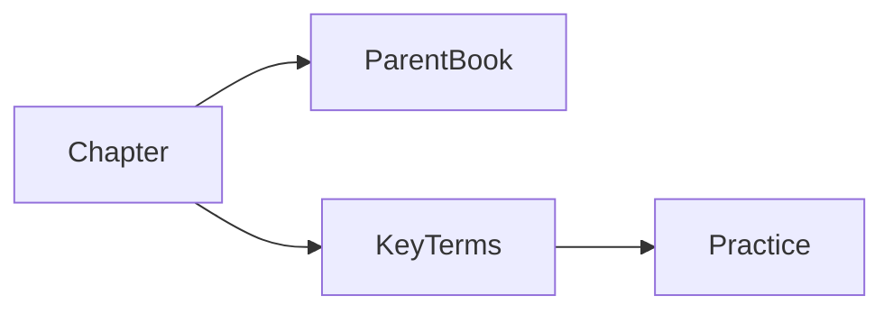

# SLP Chapter 11 (Standalone Chapter)

## Pourquoi ce nœud — explication
One chapter pulled out of the big SLP book for focused study. Treat it as the 'read this week' slice: small enough to finish, linked back to the parent book for everything it cites.

Source file: `Speech and Language Processing Chapter 11.pdf` · [[index-research]]

En bref: $$\mathrm{score}(q, d) = \cos(\mathbf{q}, \mathbf{d})$$

## Contents (14 sections — every entry links somewhere)
- [[research/slp-ch11/datasets|datasets]]
- [[research/slp-ch11/document-scoring|document scoring]]
- [[research/slp-ch11/efficiently-finding-documents-the-inverted-index|efficiently finding documents the inverted index]]
- [[research/slp-ch11/evaluating-question-answering|evaluating question answering]]
- [[research/slp-ch11/evaluation-of-information-retrieval-systems|evaluation of information retrieval systems]]
- [[research/slp-ch11/exercises|exercises]]
- [[research/slp-ch11/historical-notes|historical notes]]
- [[research/slp-ch11/information-retrieval-with-dense-vectors|information retrieval with dense vectors]]
- [[research/slp-ch11/information-retrieval|information retrieval]]
- [[research/slp-ch11/representing-documents-as-vectors|representing documents as vectors]]
- [[research/slp-ch11/retrieval-augmented-generation-rag|retrieval augmented generation rag]]
- [[research/slp-ch11/retrieval-based-models|retrieval based models]]
- [[research/slp-ch11/summary|summary]]
- [[research/slp-ch11/term-weighting-tf-idf-and-bm25|term weighting tf idf and bm25]]

## Practice — open in app
- [[pdf:Speech and Language Processing Chapter 11.pdf|Open Speech and Language Processing Chapter 11.pdf]]
- [[quiz:3|ML starter quiz]]

## Liens
- [[slp-book]]
- [[index-research]]

#nlp #chapter #study-slice #research #lecture
